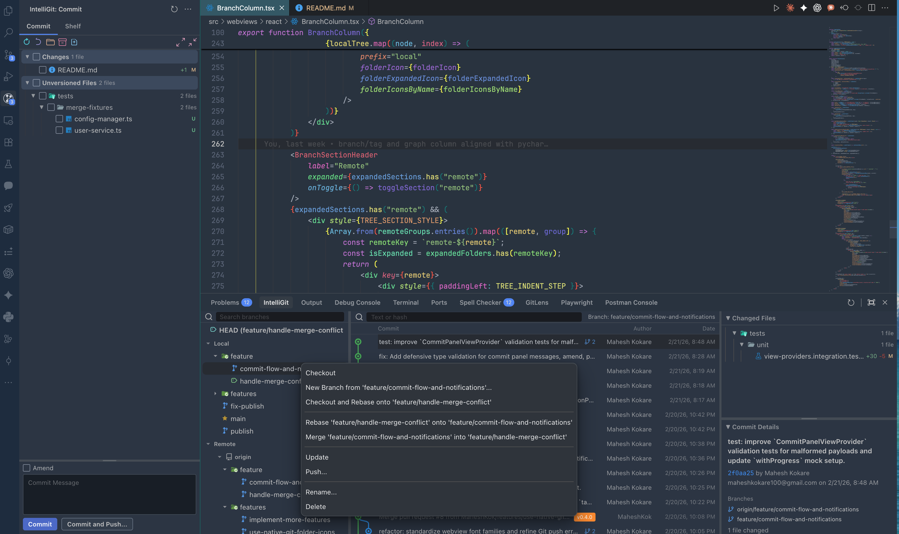

# IntelliGit - PyCharm Git for VS Code

IntelliGit brings a JetBrains-style Git workflow into VS Code, so you can stage, commit, inspect history, and manage branches without bouncing between multiple tools.



## How Users Benefit

- Move faster on daily Git work with one focused UI for commit, history, and branch actions.
- Reduce context switching by keeping staging, diffs, commit graph, and commit details in IntelliGit panels.
- Handle risky Git operations with guardrails (confirmations and action availability rules for pushed/merge commits).
- Get familiar behavior if you are coming from IntelliJ/PyCharm Git tooling.

## Core Workflows

### 1) Commit and Shelf Workflow (Sidebar)

- Commit tab with file tree, selective staging checkboxes (section/folder/file), diff open on click, and commit message area
- Toolbar actions: Refresh, Rollback, Group by Directory, Shelve, Show Diff Preview, Expand All, Collapse All
- Commit, Commit and Push, and Amend support
- Shelf tab for stash-based "shelf" workflow: save full or partial changes, then Apply, Pop, or Delete

Why this helps:
- You can build clean commits quickly, even in large change sets.
- You can park unfinished work safely and come back later without losing flow.

### 2) Commit Graph and History (Bottom Panel)

- Three-pane layout: branch column, commit list/graph, and commit detail pane
- Canvas-based lane graph with infinite scroll pagination for large histories
- Text/hash search and branch filter
- Selected commit shows changed files, file stats, and commit metadata

Why this helps:
- You can understand branch history and merge paths faster.
- You can inspect any commit without leaving the graph context.

### 3) Branch Management (From Branch Column Context Menu)

Available actions:

| Action | Applies To |
|--------|------------|
| Checkout | Local, Remote |
| New Branch from... | Current, Local, Remote |
| Checkout and Rebase onto Current | Local, Remote |
| Rebase Current onto Selected | Local, Remote |
| Merge into Current | Local, Remote |
| Update | Current, Local |
| Push | Current, Local |
| Rename... | Current, Local |
| Delete | Local, Remote |

Why this helps:
- Most branch operations are available directly where you browse history.
- Less command-line overhead for common branch maintenance tasks.

### 4) Commit Context Actions (From Commit Row Context Menu)

- Copy Revision Number
- Create Patch
- Cherry-Pick
- Checkout Revision
- Reset Current Branch to Here
- Revert Commit
- Undo Commit (unpushed, non-merge)
- Edit Commit Message (unpushed, non-merge)
- Drop Commit (unpushed, non-merge)
- Interactively Rebase from Here (unpushed, non-merge)
- New Branch
- New Tag

Why this helps:
- Advanced history editing is available in-place, with safer availability rules.

### 5) Workspace Change Badge

- Activity bar badge shows current changed-file count in the workspace

Why this helps:
- You always know if your working tree is clean before pushing or switching context.

## Quick Start

1. Open a Git repository in VS Code.
2. Open IntelliGit from the activity bar.
3. Use the `Commit` tab to stage files, write a message, and commit.
4. Open the bottom IntelliGit panel to inspect graph history, filter by branch, and review commit details.
5. Use branch or commit context menus for advanced operations.

## Keyboard Shortcut

| Key | Command |
|-----|---------|
| `Alt+9` | Focus IntelliGit commit graph panel |

## Requirements

- VS Code `1.96.0` or later
- Git installed and available on `PATH`

## Installation

### From Marketplace

Search for **IntelliGit** in VS Code Extensions, or install from:

- [VS Code Marketplace](https://marketplace.visualstudio.com/items?itemName=MaheshKok.intelligit)
- [Open VSX Registry](https://open-vsx.org/extension/MaheshKok/intelligit)

### From VSIX

```bash
bun install
bun run package
code --install-extension intelligit-*.vsix
```

## Development

```bash
# Install dependencies
bun install

# Build (development)
bun run build

# Watch mode
bun run watch

# Run linter
bun run lint

# Type check
bun run typecheck

# Run tests
bun run test

# Format code
bun run format
```

## Architecture (High Level)

```text
GitExecutor (simple-git wrapper)
    |
GitOps (operations layer)
    |
View Providers (extension host orchestration)
    |
Webviews (React apps for commit panel + commit graph panel)
```

Data flow highlights:

1. Commit selection in graph requests commit details from extension host and updates detail pane.
2. Branch selection filters the graph and clears stale commit detail state.
3. Commit panel file count updates the activity badge.
4. Refresh reloads branch state, history, and commit panel data together.

## Tech Stack

| Component | Technology |
|-----------|------------|
| Extension host | TypeScript (strict), ES2022 |
| Git operations | simple-git v3 |
| Webviews | React 18 |
| Graph rendering | HTML5 Canvas |
| Bundler | esbuild |
| Package manager | Bun |
| Testing | Vitest |
| Linting | ESLint |
| Formatting | Prettier |

## License

[MIT](LICENSE)
